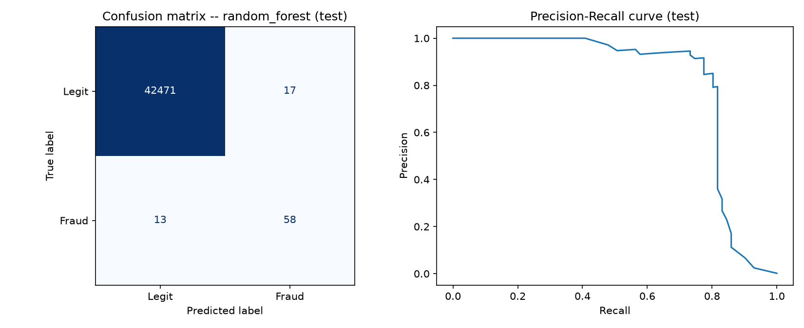
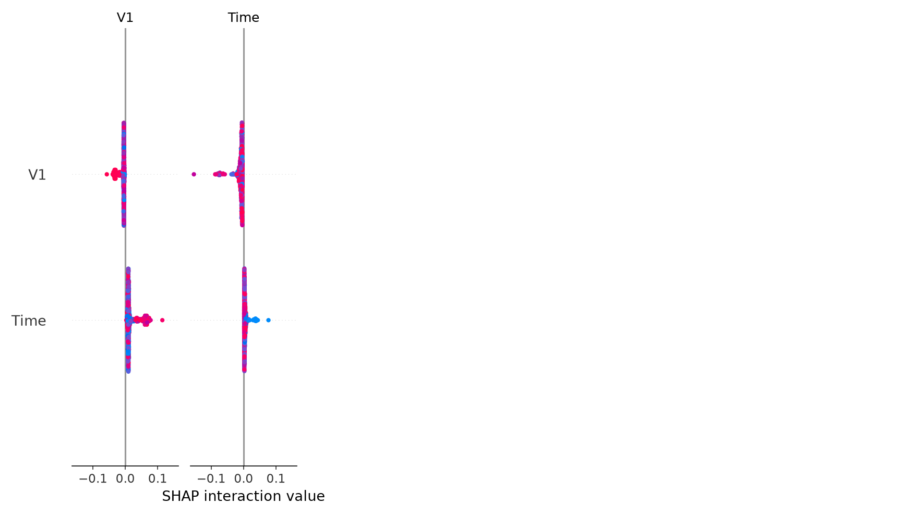

# Credit Card Fraud Detection

For this project I built a model that flags fraudulent credit card transactions using the Kaggle [Credit Card Fraud Detection](https://www.kaggle.com/datasets/mlg-ulb/creditcardfraud) dataset. It has 284,807 transactions and only about 0.17% of them are fraud.

What I really wanted to learn was how to evaluate a model properly when the data is this imbalanced. That meant avoiding data leakage, picking metrics that don't reward a useless model, tuning the threshold on validation data only, and using the test set just once.

## Results

My final model was a Random Forest with a decision threshold of 0.15 (picked using the validation set). I evaluated it once on a held-out test set of 42,559 transactions, 71 of which were fraud.

| Metric | Value |
|---|---|
| Fraud precision | 0.773 |
| Fraud recall | 0.817 |
| Fraud F1 | 0.795 |
| Macro-F1 | 0.897 |
| AUC-PR | 0.803 |
| AUC-ROC | 0.961 |

It caught 58 frauds, missed 13, and raised 17 false alarms.

A model that just predicts "legit" every time gets 99.8% accuracy but a macro-F1 of only 0.50. That's why I didn't use accuracy to judge anything.

I compared three models on validation AUC-PR: Random Forest (0.853), XGBoost (0.822) and Logistic Regression (0.697). Since there are only about 70 fraud cases per split, I think Random Forest and XGBoost are basically comparable, even though Random Forest scored a bit higher.

## What I did

1. **Cleaning:** I removed 1,081 duplicate rows before splitting so the same row couldn't end up in both train and test.
2. **Split:** stratified 70/15/15 train/validation/test so every split has the same fraud rate.
3. **Baseline:** a majority-class predictor, to show why accuracy is misleading here.
4. **Models:** Logistic Regression (with scaled features), Random Forest and XGBoost. I used class weighting instead of SMOTE because the V1-V28 features are anonymized, so synthetic samples wouldn't really mean anything.
5. **Model selection:** I chose the model by validation AUC-PR, because ROC-AUC looks great when negatives dominate.
6. **Threshold tuning:** I assumed a cost of $100 per missed fraud and $5 per false alarm, then found the threshold with the lowest total cost on validation. I also tried four different cost ratios, and 0.15 still held up in 3 of them.
7. **Final test:** test set used one time only.
8. **Extra analysis:** calibration curve, error analysis by transaction amount, SHAP, and a small experiment with routing predictions by confidence.

## What I found

- **Important features (SHAP):** the model leans most on V12, V14, V4, V10 and V3. Low values of V12, V14, V10 and V3 and high values of V4 push the prediction toward fraud.
- **Missed fraud:** the missed cases had a higher average amount than the caught ones (about $248 vs $104), but the median was low (about $30). So a few large misses are pulling the average up.
- **Calibration:** it looks reasonable at the low and high ends, but there's too little data in the middle to say much. I think the probabilities are fine for ranking and thresholding, but I wouldn't trust them as exact risk numbers.

## Limitations

- I used a random split instead of a time-based one (the data only covers about 2 days), so I couldn't test for concept drift.
- The costs are my own assumptions, not real chargeback or customer data.
- The test set only has 71 fraud cases, so the test metrics are pretty uncertain.
- I didn't tune hyperparameters beyond class weighting.
- The features are PCA-anonymized, so I can't tie something like V14 to a real transaction attribute.

## What I'd do next

1. Add bootstrapped confidence intervals to the test metrics.
2. Try RandomizedSearchCV on Random Forest and XGBoost.
3. Compare class weighting with SMOTE.
4. Make the cost of a missed fraud depend on the transaction amount.
5. Try time-based validation on data covering weeks or months.

## Tools

Python, pandas, NumPy, scikit-learn, XGBoost, SHAP, matplotlib.
